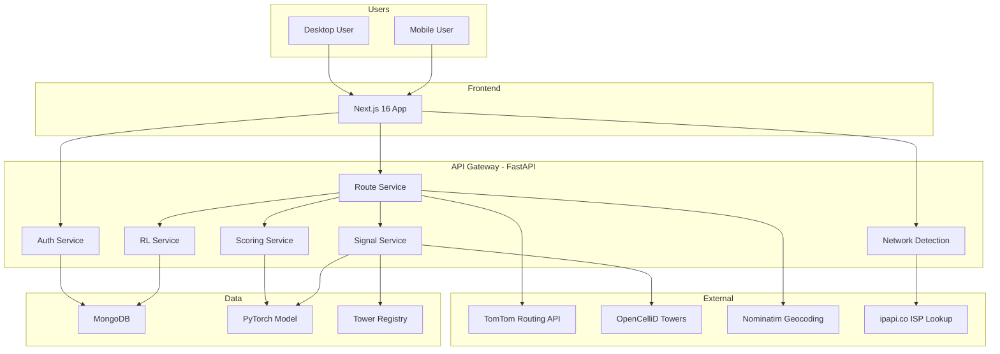
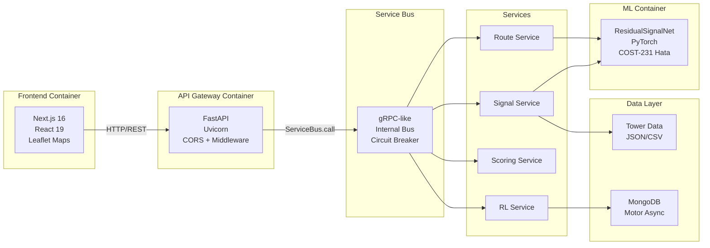
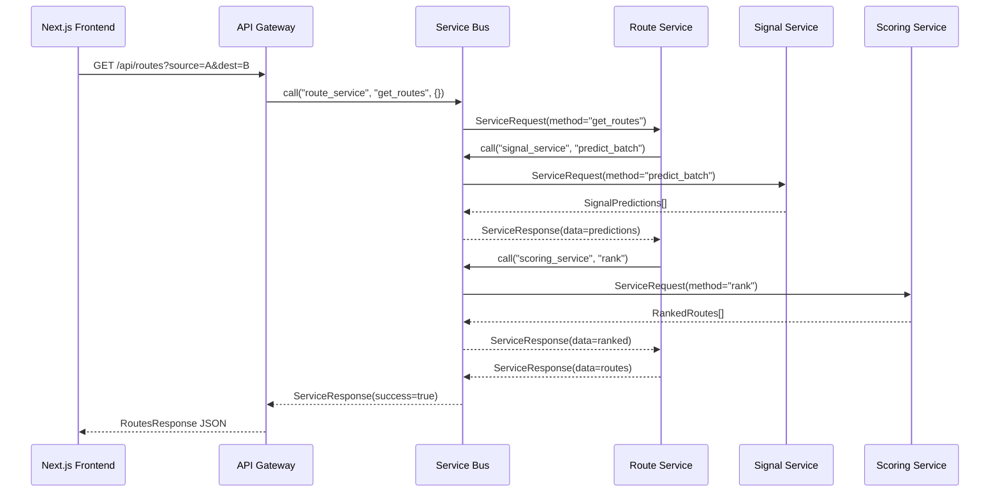
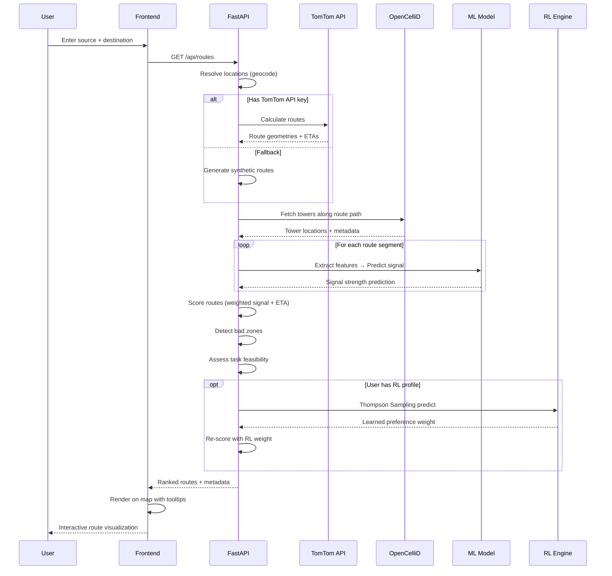
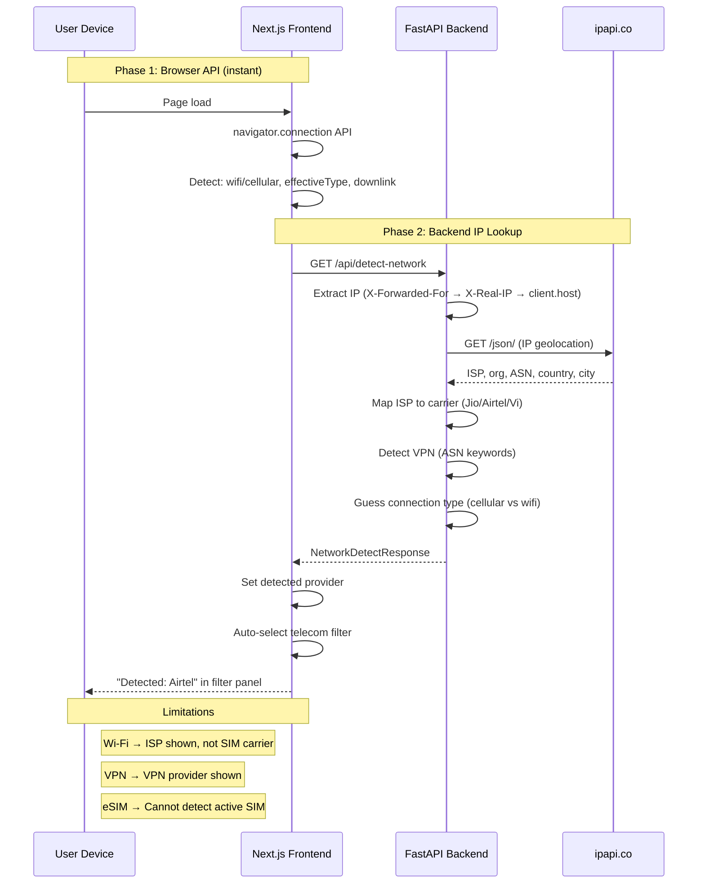
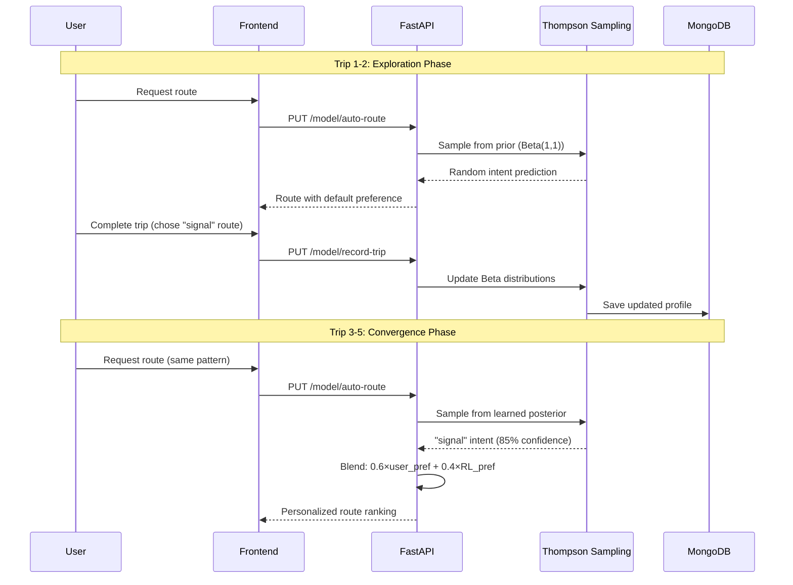
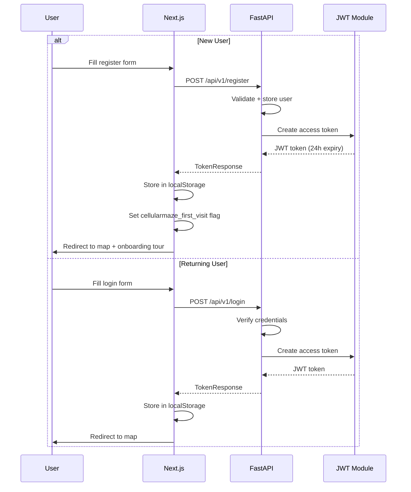

# Cellular Maze -- Enterprise Architecture Overview

## System Context

Cellular Maze is a cellular network-aware routing system that scores candidate routes based on predicted signal quality, ETA, and distance. It uses a physics-based ML model, real cell tower data, and Thompson Sampling RL for per-user personalization.



## Container Architecture



## Internal Service Bus (gRPC-like)



## Route Request Flow (Complete)



## ISP/Carrier Detection Flow



## RL Personalization Flow



## Authentication Flow



## Scoring Formula

The weighted score combines signal quality and travel time:

```
weighted_score = (signal_weight × signal_score) + ((1 - signal_weight) × eta_score)
```

Where:
- `signal_weight` = user preference (0-100) / 100, optionally adjusted by RL
- `signal_score` = ML-predicted average signal strength along route (0-100)
- `eta_score` = normalized ETA score (100 = fastest, scaled inversely)

### Signal Score Computation

```
signal_at_point = predict(
    distance_to_nearest_tower,
    tower_frequency,
    tower_type (4G/3G/2G),
    time_of_day,
    weather_factor,
    vehicle_speed
)

route_signal_score = mean(signal_at_point for each sampled point)
```

### Physics Model (COST-231 Hata + Residual ML)

```
path_loss(dB) = 46.3 + 33.9·log10(f) - 13.82·log10(hb)
                - a(hm) + (44.9 - 6.55·log10(hb))·log10(d) + C

signal_strength = ResidualSignalNet(
    physics_features=[path_loss, distance, frequency, height],
    context_features=[time, weather, speed, tower_density]
)
```

## Technology Stack

| Layer | Technology | Purpose |
|-------|-----------|---------|
| Frontend | Next.js 16, React 19 | SSR + client-side rendering |
| Styling | Tailwind CSS 4 | Utility-first CSS |
| Maps | Leaflet + react-leaflet | Interactive map rendering |
| Animation | Framer Motion | UI micro-animations |
| Icons | Lucide React | Consistent icon system |
| API Client | Axios + React Query | Data fetching + caching |
| Backend | FastAPI + Uvicorn | Async API server |
| ML | PyTorch | Signal prediction model |
| RL | Thompson Sampling (custom) | User preference learning |
| Database | MongoDB + Motor | Async document store |
| Routing | TomTom API / OSRM | Road-network routing |
| Towers | OpenCelliD API | Cell tower registry |
| Geocoding | Nominatim (OSM) | Location search |
| ISP Detection | ipapi.co | IP-based carrier lookup |
| Auth | JWT (PyJWT) | Token-based authentication |

## Data Flow Summary


## Scaling Considerations

| Concern | Current Solution | Production Path |
|---------|-----------------|-----------------|
| ML Inference | In-process PyTorch | TorchServe / Triton on GPU |
| Tower Data | JSON file + API | Redis cache + periodic refresh |
| User Profiles | In-memory / MongoDB | MongoDB sharded cluster |
| Routing | TomTom API (external) | Self-hosted OSRM for cost |
| Geocoding | Nominatim (external) | Self-hosted Nominatim |
| ISP Detection | ipapi.co (1000/day) | MaxMind GeoLite2 (local DB) |
| Auth | In-memory JWT | OAuth2 + Redis session store |
| Monitoring | Structured logging | Prometheus + Grafana |
